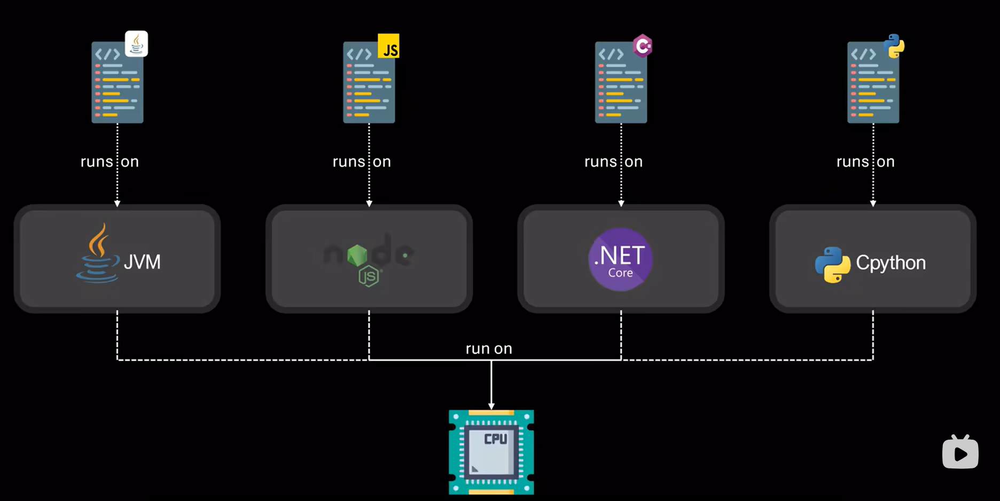

# 乱码原理与解决

## 计算机的本质

```plaintext
用来计算和处理电信号的机器
```

#### 二进制

计算机由大量晶体管组成，每个晶体管只存在高电平与低电平

- 1：高电平（2.4-5V ）
- 0：低电平（0~0.4V ）

```plaintext
各种图像、软件是封装好的二进制
```

## 计算机存储数据

### 计算机存储文字

```plaintext
文字用十进制数字编号，十进制转换成二进制储存
```

- **码位**：用来代表字符的二进制数


- **bit（二进制位）**：用来表示 0/1 的位置

- **byte （字节）**：8 个 bit组成，是计算机用于表示数据的基本单位，一个 byte 有256（2e8）种取值。

- **单位**：KB（千字节），MB（兆字节），GB（吉字节），TB（太字节），PB（拍字节），EB（艾字节），ZB（泽字节），YB（尧字节）。

### 编码与解码

- **ASCII表**：所有英文 + 标点仅有128，用了一半的码位，1963年美国国家标准协会排号 0~127 组成了ASCII码表（美国i信息交换标准代码）
- **编码**：字符按照 ASCII表 转换为十进制数
- **解码**：十进制数按照 ASCII表 转换为字符


### 字符集与乱码

- **字符集**：世界各个国家和地区制定了支持不同语言的字符集
- **乱码**：不同字符集读取同一码位会导致乱码；读取到不存在的码位会出现无意义字符

- **Unicode（万国码）**：统一码联盟制定的囊括世界各国文字的超大字符集（一个字符占据3~4个 byte ）
- **UTF-8**：针对Unicode的可变长度字符编码，支持1115200个码位，为不同字符动态分配1~4个 byte
  	- ASCII字符：1 byte
  	- 拉丁文、希腊文等：2 byte
  	- 中日韩文、埃塞俄比亚语（会跳舞的字符）：3 byte
  	- 少数字符和古代文字（古埃及象形文字）：4 byte

### 常见问题与修复

- **UTF-8没有完全解决乱码，由于新旧编码切换，造成了更多离谱的乱码**
  	- 早期记事本保存中文乱码的原因：GBK编码被当成UTF-8错误读取了（开头很像）*win10后续版本已修复。*

- **修复：**查询字符集 + 切换字符集打开

  - **Tips**：字符集正确也不一定显示正常，因为**字符集正确只能保证计算机编码正常，但是解码是否正常又是另外一个问题**

  - 字体决定一段内容的最终呈现效果，不合适的字符

  - 字体回退：使用了字体不支持的字符，系统而后软件查找另一个支持该字符的字体显示，向字体开发人员反馈
  - 不可修复：文件损坏、病毒感染、软件Bug，向软件开发人员反馈

- **平时要做好文件备份**

# 为什么应用程序是特定于操作系统的？

应用程序不止与架构相关，还与操作系统相关

### 兼容性问题

系统调用通常以函数存在，并大致分为六种，每个操作系统提供自己独特的一套系统调用，用户程序极度依赖系统调用。不同操作系统查询到**未定义行为**的系统调用会导致程序崩溃。

### 系统调用：

操作系统可以同时运行多个进程

CPU是核心部件，为防止利用CPU攻击电脑，CPU有两种运行模式，用户模式和内核模式，用户模式只可以使用有限的指令集。

操作系统在内核模式。

因此当用户需要操作硬件时，需要请求操作系统代为处理。

- 例如一个程序要打开文件写入内容，会调用一个相应的**系统函数**，要求操作系统完成定位磁盘上的文件并写入内容。

当程序需要向操作系统请求某些东西时，会触发中断，使CPU切换到内核模式，并由操作系统来控制。

**操作系统如何知道请求的是哪个系统调用？参数如何传递？：**为每个调用分配一个唯一的编号，在用硬件级别调用系统调用之前，程序会将对应的编号写入寄存器中，操作系统接管后，它会读取寄存器的值，并查阅系统调用表以确定请求的是哪个系统调用。

**如果两个操作系统使用完全相同的系统调用表，就能保证兼容性吗？：**被用来指定系统调用编号的寄存器可能不同，所以不能保证。

**如果两个操作系统使用完全相同的系统调用表，就能保证兼容性吗？：**参数传递方式取决于操作系统，有些系统将参数存储在寄存器中，有些系统将参数写入特定内存区域，或者两者结合使用。

- 例如Linux中一个系统调用如果少于6个参数，它们必须存储在寄存器中，超过6个参数，剩下的参数会写入内存

**参数在内存中的存储也不同：**使用栈存储，还是特定内存位置？

**应用二进制接口（ABI）：**定义类在特定操作系统和架构上二进制代码不同组件如何交互

### 其他原因

**可执行文件格式：**对于计算机来说，在全是0和1的文件中，程序的每个部分（数据、元数据、指令等等）位于何处，不同操作系统的定义不同。

- Linux使用可执行与可链接格式；Windows使用便携式可执行文件格式

**运行时环境：**一些编程语言不会直接编译成机器码，它们会运行在虚拟机或解释器上。那么只要系统上安装了虚拟机（例如JVM），同样的代码就可以跨多个平台运行，虚拟机就是为了绕过各种兼容性问题。



现代应用程序通常以模块化方式构建，如果每个模块都被编译成机器码那很棒，但是如果有一个模块依赖于运行时环境，但这个环境并没有被安装在机器上，那么整个应用程序可能都无法正常运行。

# CPU GPU NPU


