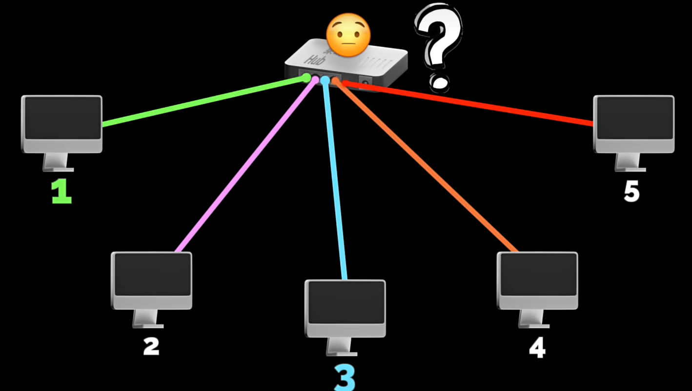
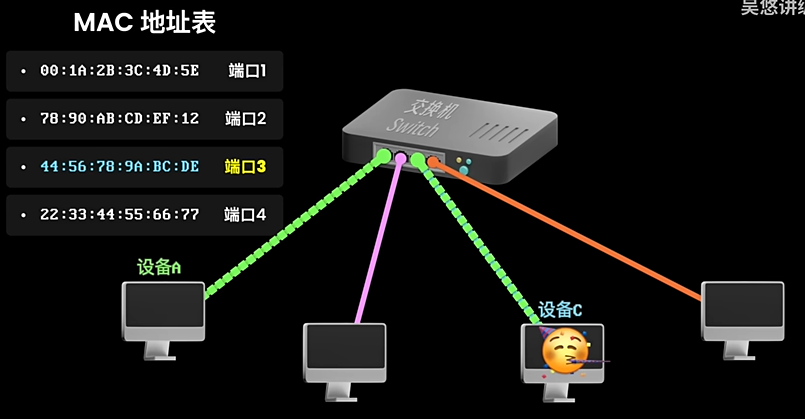
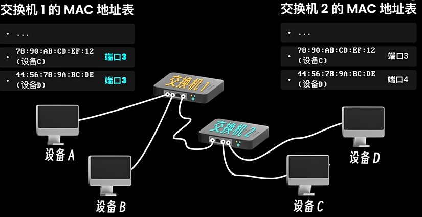
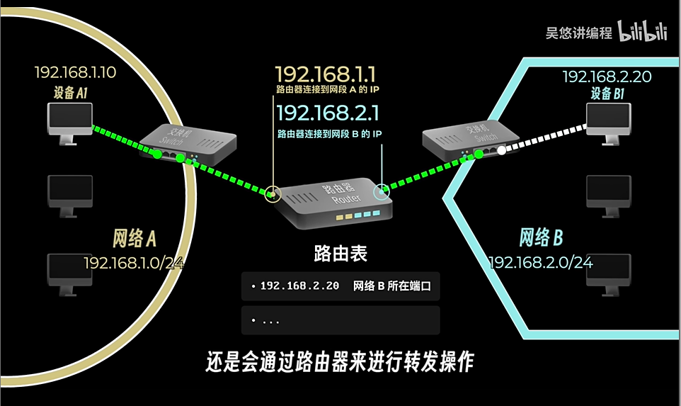

# 常识

## 问题

- 手机和电脑怎么通信？
- 洲际网络如何连接？
- 网络是什么？
- 海底光缆被切断和我们有关系吗？

## 计算机的本质

```plaintext
用来计算和处理电信号的机器
```

#### 二进制

计算机由大量晶体管组成，每个晶体管只存在高电平与低电平

- 1：高电平（2.4-5V ）

- 0：低电平（0~0.4V ）

```plaintext
各种图像、软件是封装好的二进制
```

## 实现计算机通信

#### 两台计算机

通过一根线链接设备 电信号传输 （**台数多就费线**）

#### 集线器（Hub）

用来转发消息的设备



**缺点**

```plaintext
1.采取群发 隐私性差 已淘汰
2.半双工工作模式 无法同时实现双向通信 类似于对讲机
```

#### 交换机

- 在出厂时会记录设备的全球唯一标识：MAC地址（00:1A:2B:3C:4D:5E）

- 全双工工作模式 类似于电话

- 提高了带宽的利用率

  

- 支持桥接：一根线连接两个交换机，实现互相访问

  

**缺点**

```plaintext
1.局域网可用（一般为学校教学/公司用）
2.交换机记录的 MAC 地址有限（几千到几万），设备太多，表会被写满，新的 MAC 地址会覆盖就地址
3.多个交换机链接，消息传播路径会变长，连接顺序不合理会出现广播风暴、环路等问题
```

#### 路由器

（不是WIFI无线路由器 是专门的网络设备）

```plaintext
基于路由算法，找到两个网络之间的更优路径，适用于多个网络互互联和数据转发。
```



#### IP地址

区分不同网段的网络设备，临时标识，最终通信依然是 MAC 地址

**让设备A1与B1通信：**

- 路由器的准备工作

​		- 分配网段（192.168.1.0/24）

​		- 连接端口（192.168.1.1）//默认网关IP

​		- 分配IP（192.168.1.10）

- A1-B1：
  	- A1要将数据发送给路由器
  	- 在网络A寻找 IP 所对应的设备，找不到（在网络B） ------ 发送给路由器
  	- 路由器存在路由表（记录 IP 和端口映射关系）------ 路由器根据路由表决定如何将数据转发到网络B
  	- 在网络B中找到 IP 端口对应的 B1 的 MAC 地址， 发送数据
  	- A1 会记录下 B1 的 MAC 地址， BUT **分处不同网段 无法直接通信，后续通信流程基本一致**。

#### 全球通信（人类奇迹 互联网）

**公网IP**：

- IPv4 可标识 2e32 个网络设备 （43亿左右）------ 2019/11/26 耗尽

- IPv6 可标识2e128个网络设备

**海底光缆：**

洲际通信：全球有数百条（建设ing）


## Cookie/Session/Token

```plaintext
Session 是一种能力：是服务器见鬼说鬼话，见人说人话的能力
Token 是一个字符串凭证：和你的各种证件一样功能的凭证，JWT 恰好是其中一种格式
Cookie 是浏览器中的一个存储技术：历史很久了，不用这个也可以

以上连起来就是，你从自己的小钱包（Cookie） 里掏出了身份证（Token），递给了窗口（服务器）里面，从而达成了一种Session 能力
```


有两个问题：
1.jwt泄露呢，谁都可以登录了，有啥解决办法吗?
2.客户端请求长时间没响应，如何主动放弃请求呢