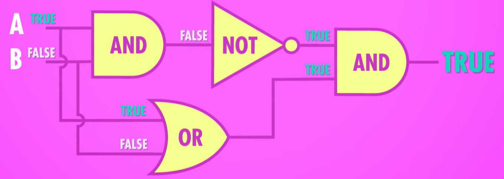
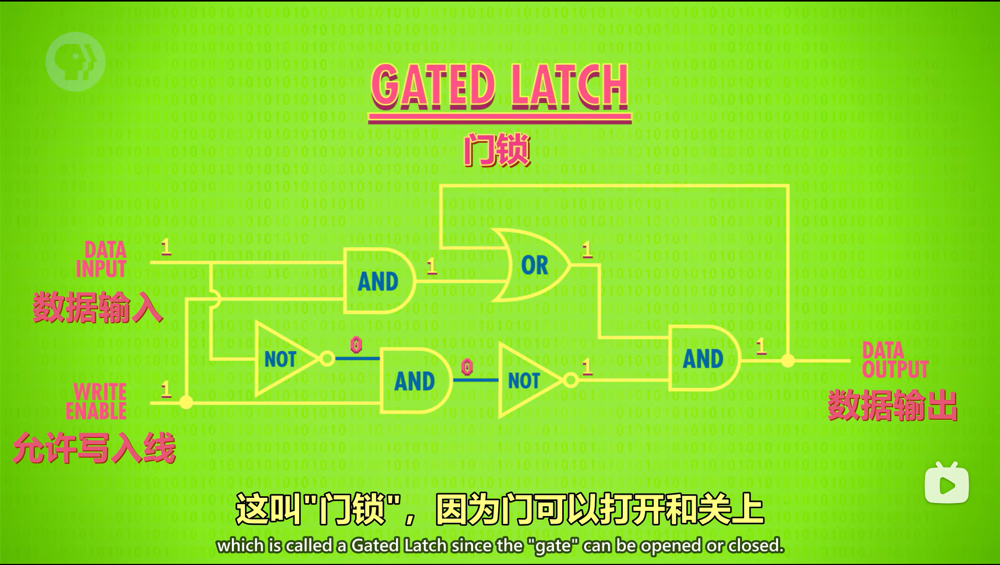
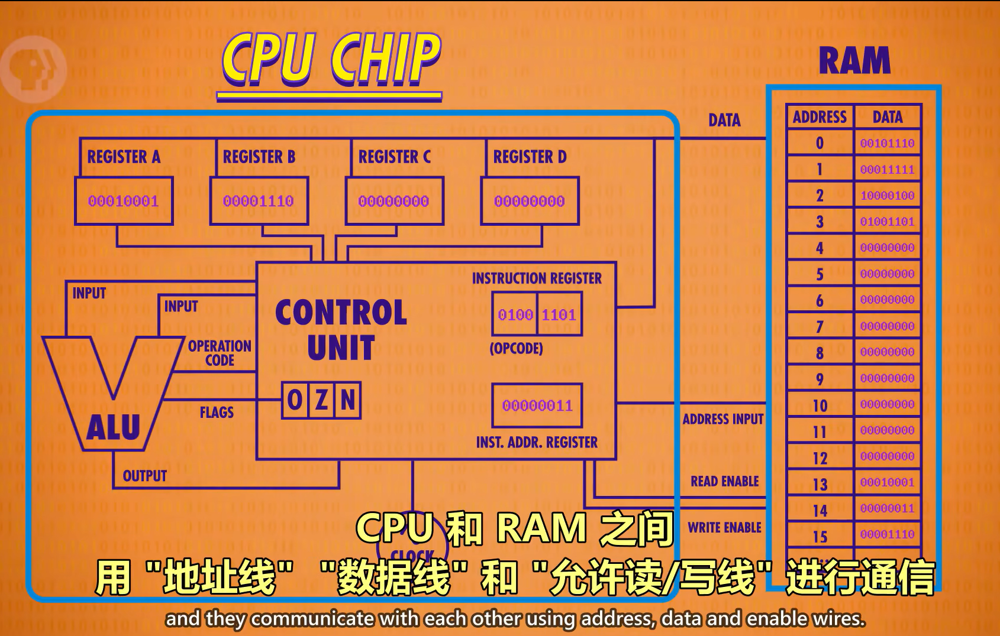
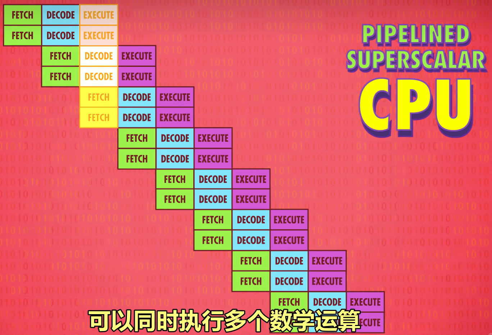

计算机科学速成课

# 一、硬件部分

## 1、计算机早期历史

- 计算机设备发展：
  - 算盘-
  - 步进计算器（第一个可以做加减乘除的机器）-
  - 差分机-
  - 分析机（通用计算机，Lovelace写了假想程序，第一个程序员）-
  - 打孔卡片制表机（人口普查）
- 计算机的本质：极其简单的组件，经过一层层复杂的抽象，做出复杂的工作
- 早期历史：IBM机器制表公司

## 2、电子计算机

 拥有了细微控制电流的手段

- 计算机设备发展：
  - 继电器（1s最多50次开关，发现死虫子是bug来源，）-
  - 真空管（“巨人一号”大规模使用真空管，编程需要配置）-
  - 第一台通用可编程电子计算机（ENIAC）-
  - 晶体管（1s可以开关1w次；晶体管：<50nm/a4纸：10wnm；硅谷：晶体管和半导体的基础材料是硅）
- 肖克利半导体-仙童半导体-英特尔

## 3、布尔逻辑和逻辑门

- 电流可以传递信号，通过电路逻辑门可以参与逻辑运算

- 二进制：通电1 断电0 防干扰，拥有数学布尔代数的现成优势基于此引出基本的逻辑电路

- NOT 非门（on - 接地 -->实现off）：真假反转【三角形前有一个圆点】

- AND 与门（两个晶体管串联）：同真为真，一假即假【D形】

- OR 或门（两个晶体管并联）：一真为真，同假为假【太空船形】

- XOR 异或门：同假异真

  

可将逻辑门用符号简化，抽象使得工程师更加关注于整体而不必关心细节

## 4、二进制

- 信号可以存储信息

- 0 1 皆为1位 bit 8位为1字节 byte

- 数的存储

  - 整数，一位符号位，其余皆数位

  - 浮点数 符号位 指数位 有效数位

ASCII Unicode

## 5、算术逻辑单元

- 逻辑门可以抽象成算术逻辑单元
  - 算术逻辑单元 ALU，Arithmetic&Logic Unit 由一个算数单元和一个逻辑单元组成

- 算数单元：
  - 由基础的门组件抽象成半加器（只能用于一位运算），多个半加器抽象成一个全加器（可用于多位运算）
  - 溢出的概念：吃豆人
  - 乘除法

- 逻辑单元：

  - 执行逻辑操作及数值验证操作

  - 把算数逻辑单元再次进行抽象，用V表示
  - FLAG标志 （是否相等、是否小于、是否溢出）

## 6、寄存器和内存

逻辑门可以抽象成存储结构

- RAM：随机存取存储器，就是内存（内存条）。只在有电的情况下存储东西，比如游戏状态，且只记录当前的事
- memory：持久存储，电源关闭数据也不会丢
- 更多内存存储技术都是矩阵层层嵌套来存储大量信息

- 使用逻辑门可抽象成锁存器（存储一位），多个并列的锁存器抽象成一个寄存器（可用于多位存储）

  -  锁存：放入数据-写入；拿出数据-读取

  - 使用门锁矩阵有利于统筹管理，对访问和修改的权限进行限制
  - 

  - 寄存器能存一个数字。这个数字有多少位（二进制），叫做“位宽”
    - 64位宽需要129条线：并排放置
      - 数据线-64，连接输出端的线-64，启用所有锁存器线-1
    - 256位宽只需要35条线：矩阵存储
      - 数据线-1， 允许写入线-1，允许读取线-1，矩阵上选择锁存器的线-16+16
    - 行列表示：二进制地址（12行8列：11001000）
    - 地址转行列：多路复用器
      - 两个多路复用器，一个处理行，一个处理列

- 内存是由多个存储模块抽象出来的 

## 7、中央处理器CPU

- 逻辑门的抽象组合成更高的抽象 ：CPU
  - CPU负责执行程序，时钟精准地调控着CPU的运行节奏
  - CPU内部如果用一条线连接两个组件，这条线是所以必要线路的抽象
  - CPU工作过程主要有三步：取指令，解码，执行
- 组一个CPU
  - RAM-1：八位
  - 寄存器-4：临时存储和操作数据
  - 指令地址寄存器-1：追踪程序运行到哪里了，存当前指令的内存地址
  - 指令寄存器-1：存当前指令
- CPU运行程序的过程
  - 所有寄存器初始值为0
  - 取指令阶段：对应内存地址（例如0）的值（例如00101110）会复制到指令寄存器
  - 解码阶段：值（例如00101110）
    - 前四位 0010 是LOAD_A：表示将RAM的值存入寄存器A
    - 后四位 1110 （14）是RAM地址
  - 执行阶段：根据解码得到的 14 ，将RAM 14 对应的值存入寄存器A
  - 指令完成后关掉所有线路，不同指令由不同逻辑电路解码
- 时钟：负责管理CPU的节奏
  - 时钟以精确的间隔出发电信号

- 时钟速度（Hz）：CPU“取指令-解码-执行”的速度
  - 1Hz = 1s一个周期
    - 6分钟完成4条指令：0.03Hz
    - 如今的电脑和手机：几千兆赫兹（1s10亿次时钟周期）

  - 计算机超频：修改时钟速度，加快CPU的速度
    - 超频太多会让CPU过热/产生乱码

  - 计算机降频：用户离开/运行性能要求较低的程序时降频可以更省电（动态调整频率）

## 8、指令和程序

-  强大而抽象的控制方式 ：指令与程序

- 指令集是指令的使用说明，不同指令具有不同简单的功能，多个指令组合成强大的程序，可以去处理复杂的任务。

## 9、高级CPU设计

- 现代CPU的性能性能提升，使用新的制造工艺

  - 增加核心数

  - 提高时钟频率

  - 增加缓存容量

  - 改进设计架构

- #### 优化一个指令流吞吐量的性能提升1-   缓存（cache）：

  CPU从内存（RAM）拿数据时，内存（RAM）不用传一个，可以传一批；时间长，但是可以缓存

  - 缓存（cache）离CPU近，一个时钟周期就能给数据，CPU不用空等
  - 缓存命中：想要的数据已经在缓存
  - 缓存未命中：想要的数据不在缓存
  - 用途：当临时空间，存一些中间值，适合长/复杂运算
  - 脏位：缓存（cache）中计算出的内容和原来内存（RAM）中已有的数据不相符合 的数据 为“脏”
    - 缓存满了而CPU又要缓存时，在清理缓存腾出空间之前，会先检查“脏位”
    - 如果数据时“脏”的，在加载新内容之前，会把数据写回内存（RAM）

- #### 一个指令流吞吐量的性能提升2-   指令流水线：

  - 并行处理：执行一个指令的同时，解码下一个指令，读取下下下个指令

  -  乱序执行（流水线非常高效所以几乎所有处理器都有流水线）：必须要明确指令间的依赖关系，必要时要停止流水线

  - 条件跳转：这些指令会改变程序的执行流

  - 推测执行：CPU会猜测哪条路可能性更大，然后提前将指令放进流水线

    - 分支预测：CPU厂商开发推测执行准度更高的分支路径，现代CPU正确率超过90%

    - 理想情况下，流水线一个时钟周期完成一个指令

  - 超标量处理器：一个时钟周期完成多个指令。
    - 即便有指令流水线，处理器也会有闲置的部分

	

- ####  同时运行多个指令流的性能提升：多核处理器：

  - 一个CPU芯片里，由多个独立处理单元，像是有很多个独立CPU
    - 整合紧密，可以共享一些资源-   缓存：多核合作运算
  - 双核/四核是最常见的

- #### 超级计算机：神威·太湖之光

## 10、早期的编程方式''\（· &forall; ·）/*

穿孔纸卡，纸带，插板，开关

- 存储程序计算机：数据寄存器+指令寄存器+指令地址寄存器+内存（存数据和指令）
- 程序和数据需要某种方式输入计算机

------

# 二、软件部分

## 11、编程语言发展史

机器码

汇编

低级语言

高级语言

- 1960：ALGOL，LISP，BASIC
- 1970：Pascal，C，Smalltalk
- 1980：C++，Objective-C，Perl
- 1990：Python，Ruby，Java
- 千禧年后：Swift，C#，Go

## 12、编程原理-语句与函数

语句：描述一种状态

语法：规定句子的一系列规则

函数：实现一种单一的功能

## 13、算法入门

算法是一种处理数据的手段，人们常常用它寻找最优解，针对算法的效率提出了时间复杂度和空间复杂度

## 14、数据结构

数据结构是一种组织数据的手段，针对不同的数据，不同的问题，具有不同的组织方式

- 指针：一种特殊变量，指向一个内存地址，因此得名
- 链表：
  - 循环链表：一个节点包括变量和指针，最后一个节点的指针指向第一个结点内变量的地址即为循环链表
  - 非循环链表：最后一个节点的指针为0，null代表链表尽头
  - 链表数据结构：
    - 栈（后进先出）
    - 队列（先进先出）
    - 树（一个节点内两个指针，数据顺序仍为单向）
    - 图（一个节点内多个指针，数据随机组合）
    - 堆
    - 红黑树

## 15、阿兰·图灵/图灵机

图灵机可以解决一切计算问题但不能解决一切问题，和图灵机一样完备叫作图灵完备，通过图灵测试则证明计算机达到了智能程度

- 计算机科学之父：阿兰·马蒂森·图灵
  - 因同性恋被判处激素压制性欲
  - 图灵于1954年服毒自尽，享年41岁
- 图灵奖：计算机领域最高奖项，计算机界的诺贝尔奖
- 图灵测试：计算机能欺骗人类它是人类，才算是智能
  - 一个人和两个门内对话，如果分不清哪个是真人哪个是计算机，那么计算机就通过了图灵测试
  - 验证码：公开全自动图灵测试，用于区分计算机和人类

## 16、软件工程

Margaret Hamilton（女性程序员）为了预防程序出错，提出“软件工程”的概念，在NASA的阿波罗计划中避免了严重问题。

- Object（对象）：
  - 大型项目上千万行代码，将代码打包成函数还是有点不方便
    - 解决办法：将函数打包成层级，把相关代码都放在一起，打包成对象
- 面向对象编程：把相关函数打包成对象的思想，通过封装组件，隐藏复杂度
  - 核心：隐藏复杂度，选择性公布功能
  - API：程序编程接口，帮助一个团队中负责不同部分的程序员们相互使用代码
    - API控制哪些函数和数据让对象外部访问，哪些仅供对象内部使用
  - public/private：指定函数权限
  - IDE（集成开发环境）：专门用来写代码的工具
  - debugging（调试）：解决出错代码。**！！！很重要，大多数程序员会花费70%~80%的事件调试，而不是在写代码**
    - 老师推荐**Vim**（哈哈哈''\（· &forall; ·）/*）
  - 文档和注释：帮助一个团队中负责不同部分的程序员们相互理解代码。
    - 文档：**！！！很重要，一般放在README.md文件，提高代码复用性**
    - 注释：**！！！很重要，放在源代码里，帮助开发者本人和其他人理解**
  - Git（版本控制）
  - QA（质量保证测试）：一般由个人或者小团队完成，模拟各种情况，保证软件上线后尽可能的少出错，即找bug
  - Beat、Alpha：
    - Alpha版本：很粗糙、错误多，在公司内部测试（内测版）
    - Beat版：软件接近完成，但不是100%完全测试过。
      - 公司向公众发布Beat版，帮助发现问题，将用户作为免费的QA团队

## 17、集成电路与摩尔定律

- 数字暴政：想要提升性能-->加更多部件-->更多的电线和更复杂的电路 的问题
- IC（集成电路）：将电路所有组件都集成在一起（1959年仙童半导体，以硅为材料）
  - 就像电脑工程师的乐高积木，可以组合设计
  - 但还是需要连起来组成计算机
- PCB（印刷电路板）：可以大规模生产、不需要焊接和电线；通过蚀刻金属，把零件连接到一起
- PCB+IC结合使用：解决了数字暴政问题。更小、更便宜、更可靠
- 光刻：用光把复杂图案印到材料上，可以实现更复杂的设计，使得小型化成为现实。
  - 光刻分辨率：从大约1万纳米（1/10头发直径）发展到14纳米（比红细胞小400倍）

- 摩尔定律：总结了性能和成本的规律但正在受到光波长，量子效应的挑战，所以**未来计算机4.0时代就是量子计算机的世界了**

- CPU晶体管数量爆发增长（大概每十年翻三十倍）：

  - 1980年：3万
  - 1990年：100万
  - 2000年：3000万
  - 2010年：10亿

  不止CPU，大多数电子器件都在指数式发展：内存、显卡、固态硬盘、摄像头感光元件

  - 显卡：图形渲染、视频解码和编码、游戏帧率和画质、图形和数据处理、多显示器支持、虚拟现实渲染3D环境、加速机器学习和人工智能算法的计算过程
    - 集成显卡：集成在主板或处理器上，功耗较低，适合日常使用和轻度图形处理；
    - 独立显卡：单独的硬件组件，通常提高更高的性能，适合游戏和专业图形处理。

## 18、操作系统

- os（操作系统）：是一种程序，具有操作硬件的特殊权限，运行管理着其他的程序，充当着软硬件之间的桥梁

  - 批处理：计算机变便宜变多，有不同的配置，写程序处理不同硬件细节很痛苦（兼容问题一直存在），所以操作系统负责抽象硬件，让计算机自动连续运作程序而不需要人工添加
  - 设备驱动程序：提供API来抽象硬件

  - 为程序分配运算资源，存储资源，保障程序安全有序地进行

  - 为硬件提供 i/o接口，使之抽象成软件，进而对其进行操纵

- 虚拟内存：程序可以假定内存总是从地址0开始，真实的物理位置被操作系统隐藏和抽象了

  - 动态内存分配：操作系统可以自动映射，分成多个内存块的程序会按照顺序排下虚拟内存地址
  - 内存保护：一个程序出错了不会影响到其他程序的内存（老版windows缺乏内存保护，导致经常蓝屏崩溃）
    - 防控病毒

- 分时操作系统（Multics）：每个用户只能用一小部分处理器和内存等资源，防止多用户使用终端的时候不会让一个人占满全部计算机资源

## 19、内存&储存介质

- Storage（存储器）：任何写入存储器的数据，会被一直保存，直到被覆盖或删除，断电也不会丢失

- 技术创新使得存储的效率越来越高，考虑到整体的性价比，混合存储最为有利
- 发展历程：纸卡-延迟线存储器-磁芯-磁带-硬盘-内存层次结构-软盘-光盘（CD）-固态硬盘（SSD）

## 20、文件系统

- 所有文件的底层都是一样的：一长串二进制
  - 区分不同的文件格式，可以方便存取数据，支持特定应用
- 计算机怎么存文件：
  - 给每个文件预留多余空间
  - 碎片：将文件内容分块存储，多余的存到另一处地方
    - 碎片整理：将数据来回移动，排列成正确的顺序
  - 删除：在覆盖之前，原本位置的数据仍然保留，所以一些已经被删除的数据是可以恢复的

- 文件系统可以进行资源管理和保护数据
- 分层文件系统：目录文件不仅要指向文件，还要指向目录，可以实现文件夹套文件夹

## 21、压缩 

- 通过对于数据的压缩，我们可以存储更多数据和传输数据的速度也可以更快

- 压缩：

  人的视觉和听觉都不是完美的

  - 无损压缩：游程编码、字典编码 --> 不会有缺失的文件内容
  - 有损压缩：
    - 感知编码 --> 用不同精度编码不同频段，可以让图片/音频看起来差不多但是大小天差地别
      - 电话中的声音和正常声音不一样，这是为了保证可以多人同时打电话；
      - skype电话像人机
      - 网速变慢，压缩算法会删除更多的数据
    - （MPEG-4）视频编码 --> 时间冗余。视频里不是每一帧都存储全部像素，可以只存变了的部分
      - 更高级的：找出每一帧之间相似的补丁，然后用简单的效果实现，比如移动/旋转、变亮/变暗
      - 压缩太严重：没有足够空间更新补丁内的像素，即使补丁是错的，视频播放器也会照样播放

## 22、命令行界面

输入命令计算机会给予回应

- 电传打字机

- 命令行游戏：Zork，被认为是最早的互动式小说
- Crash Course 游戏速成课

## 23、屏幕&2D图像显示

随着物理的发展和人机交互的进一步需求出现了屏幕

进而催生了图像显示

- 绘制图形：
  - 矢量扫描：引导电子束描绘出形状
  - 光栅扫描：按照固定路线，一行一行扫描
- 像素：液晶显示屏（LCD）
- VRAM：专门存高速高清视频的内存，在显卡上

## 24、冷战和消费主义

政府和消费者促进计算机发展

政府巨额投资促进计算机科学的发展

消费者的选择决定计算机技术的表达形式

冷战导致美国向计算机领域投入大量资源

## 25、个人计算机革命

技术进步推动生产力的提升，计算机成为相对廉价的产品

- 比尔盖茨和保罗艾伦：编写BASIC解释器
- 乔布斯：建议买组装好的计算机 Apple-I 诞生
- 1977年出现三款开箱即用的计算机
- 计算机市场：
  - IBM兼容：IBM发现市场采用开放架构
  - 非IBM兼容：苹果选择封闭架构，在这一部分公司里只有苹果保证了足够的市场份额
- Macintosh：普通人可以买到的第一台带图形用户界面的计算机，由苹果在1984年发布

## 26、图形化用户界面GUI

- 事件驱动编程，（函数指针） 

- 所见即所得

- 微软的Windows

- 恩格尔巴特：增强人类智能

## 27、3D 图形

3D转化为2D在计算机上显示

- 线框渲染：将所有的点都从3D投影到2D之后，用画2D线段的函数来连接这些点
- 正交投影：立方体的各个边在投影中互相平行
- 透视投影：真实世界中，会汇聚到一点，就像远处的马路汇聚到一点
- 多边形：即三角形。三角形更常用是因为三个点能定义唯一的平面
- 网格：一些多边形的集合
  - 网格越密，表面越光滑，细节也越多，计算量也更大
  - 游戏设计者平衡多边形数量和真实度。
  - 简化网格算法：多边形数量太多，帧率会下降到肉眼可感知，用户会觉得卡
- **扫描线渲染**：填充图形的经典算法
  - 算法实现：取y区间，一行行扫描，取和多边形相交两点，填满两相交点之间的像素
  - fillrate：填充速率
- **抗锯齿**：因为是三角形，所以会有锯齿感，这个是用来减轻锯齿的方法
  - 实现：和多边形相交的点颜色变浅，实现羽化效果
  - 使用：字体和图标
- 遮挡：3D中一部分我们可以看见而一部分不能
- 画家算法：排序算法，由远到近排列，然后由远到近渲染
- 深度缓冲（Z-buffering算法）：记录场景中每个像素和摄像机的距离，在内存存一个数字矩阵。缓冲区，最终搭配高级扫描线渲染，确定每个像素点在最终场景中是否可见
- Z Fighting 错误：使用深度缓冲时，有两个相似的图案，谁在上面不可预测
- 背面剔除：3D游戏的优化，为了节省处理时间，忽略多边形的背面
  - bug：从模型内部往外看，头部和地面会消失
- 表面法线：三角形面对的方向
- 平面着色：最基本的**照明**算法
- 高洛德着色/冯氏着色：不止用一种颜色给整个多边形上色
- **纹理**映射：纹理在图形学中指外观而不是手感
- （GPU）图形处理单元：加速图形渲染，并行渲染
  - 在显卡上，周围有专用的RAM存储网格和纹理，可以让GPU的多个核心高速访问

## 28、计算机网络

每个计算机都有一个固定的MAC地址，用于计算机之间的通信识别，多个计算机可以组成一个局域网，局域网以上可能有更大的区域网络，从另一个有固定MAC的计算机获取数据时可能跳转多个层级局域网，而在经过传输媒介获取数据的过程中可能出现冲突，可以使用交换器将计算机分组避免，传输数据也可以将数据分组以使用数据包来运输

- 局域网（LAN）：计算机近距离组成的小型网络
- 媒体访问控制地址（MAC）：MAC地址
- 载波侦听多路访问：多台电脑共享一个传输媒介
  - 载体：运输数据的共享媒介
    - 以太网的载体是铜线
    - WIFI的载体是传播无线电波的空气
  - 带宽：媒体传输数据的速度
- 指数退避：指数级增长等待时间，降低共享传输媒介导致的冲突
- 冲突域：可以用交换机将一个冲突域拆成两个冲突域
- 电路交换：电话接线员，类似专车接送
- 报文交换：用不同路由使通信更可靠更能容错，通过路由跳转的次数叫做跳数，跳数过高路由肯定出错了，跳数限制，类似快递中转
- 分组交换：文件包过大，将数据拆分成多个小数据包，通过灵活的路由传递，类似拆分发货
- TCP/IP协议：防止小数据包乱序
- 各种协议：ICMP（因特网控制消息协议）、BGP（边界网关协议）
- 物联网：万物互联、智能家居

[详细内容](./ComputerNetwork.md)

## 29、互联网（协议和层级）

互联网是传递数据的管道，各种程序都会用

互联网是更大的计算机网络连接着更多的计算机，为了实现数据传输的要求，我们制定了诸多的协议，为了便于人类的检索习惯我们将域名和ip地址一一对应采用树状检索，为了使通信变得高效我们抽象了OSI（开放式系统互联网通信参考模型），一共七个层级

- IP（互联网协议）：数据包想在互联网上传输要遵循的协议

  - 数据包头部只有目标地址，存”关于数据的数据“ --> 元数据
  - 当**数据包到达对方电脑**的时候并不知道要把包交给那个程序

- UDP（用户数据报协议）

  - 数据包头部含有端口号（每个想访问网络的程序，都要向操作系统申请一个端口号），操作系统会读取并将**数据包交给对应的程序**
  - 校验和：存在于数据包头部，用于检查数据是否正确，如果数据包校验和与头部所保存的一致，那么数据传输正常
  - 不提供数据修复或数据重发的机制，因此发送方无法得知数据包是否到达
  - 简单快速（在线射击游戏）

- TCP（传输控制协议）

  - 所有数据必须到达的情况
  - TCP/IP：头部存在数据包前面，头部由端口号和校验和
  - 高级特性（相比于UDP）：
    - TCP数据包有序号，因此可以把数据包排成正确顺序
    - TCP要求接收方的电脑收到数据包，并且校验和检查无误后，向发送方发一个确认码（ACK）代表收到；上一个数据包成功抵达后，发送方才会发送下一个数据包，如果没收到确认码，过一段时间会重新发送一次
    - TCP可以同时发送多个数据包收多个确认码
    - TCP可以通过确认码（ACK）的成功率和来回时间推测网络的拥堵程度，调整发包数量，解决拥堵问题
  - 复杂速度慢

- DNS（域名系统）：计算机要访问一个网站需要IP地址和端口号，域名更好记忆，一个域名对应一个【IP地址+端口号】

  - 浏览器搜索不存在的域名会导致DNS错误
  - 存在的域名：浏览器根据这个IP地址发送TCP请求
  - 域名用树状结构存储
    - 顶级域名TLD（.com / .gov）
    - 二级域名（www.google.com ）
    - 子域名（images.google.com）

- OSI（开放式系统互连通信参考模型）由底层到高层

  底五层：查询DNS或者看网页的时候发生的一整套流程

  - 物理层：线路里的电信号、无线网络里的无线信号
  - 数据链路层：操控物理层。MAC、碰撞检测、指数退避、一些底层协议
  - 网络层：报文交换和路由
  - 传输层：负责计算机之间点到点的传输、检测修复错误。TCP、UDP等协议
  - 会话层：使用TCP和UDP来创建连接、传递信息、关闭连接 
  - 表示层：
  - 应用程序层：

## 30、万维网

互联网是传递数据的管道，各种程序都会用，其中传输最多数据的**程序**是万维网，可以用浏览器来访问万维网

万维网运行在互联网上，它的组成基本单位是**网页**，我们使用超链接进行网页之间的跳转，使用状态码标出网页的状态，每一个网页都有唯一的URL，使用http和html等便于我们传输网页数据和展示网页内容

万维网的诞生基础和万维网的检索方式，以及传输数据的公平性

- 页面：万维网基本组成单位

- 超链接（Hyperlinks）：去往其他页面的链接
- 超文本（Hypertext）：去往其他页面的文字链接
- URL（统一资源定位器）：为了让网页能够相互连接，每个网页需要一个唯一的地址
  - 基本组成：协议+域名（+端口+路径+查询字符串+锚点）
- HTTP（超文本传输协议）：连接到域名服务器之后，请求某个页面
- HTML（超文本标记语言）：为了标记什么是链接什么不是链接开发的标记语言
- 网页浏览器：可以和网页服务器沟通，负责获取和显示
- 1990：万维网黄金时代
- 搜索引擎：
  - 爬虫：跟着链接到处跑的软件，每当看到新链接，就加进自己的列表里
  - 不断扩张的索引：记录访问过的网页上出现过哪些词
  - 最初的查询索引的搜索算法：在搜索框内输入“猫”，每个含有猫的网页都会出现，排名方式为搜索词在页面上的出现次数
    - 出现了全是“猫”文字的垃圾网站
  - google的搜索算法：不信任网页上的内容，搜索引擎会看其他网站有没有链接到这个网站。这些反向链接的数量，代表着网站的质量
- 网络中立性：应该平等的对待所有数据包，数据和优先级应该是一样的。
  - 没有网络中立性可能会导致剥削性的服务器，会促进大公司垄断
  - 有网络中立性会导致用户喜欢的网页被限流
  - 综合考量

## 31、计算机安全

针对权限的人我们要具有验证的方式

针对计算机，我们要保证计算机本身的稳定性和数据的完整性

- 计算机安全保证我们数据的
  - 保密性（Secrecy）：只有有权限的人才能读取计算机系统和数据
    - 黑客泄露别人的信用卡信息：攻击保密性
  - 完整性（Integrity）：只有有权限的人才能使用和修改系统和数据
    - 黑客知道邮箱密码后，假冒他人发送邮件：攻击完整性
  - 可用性（Availability）：有权限的人随时可以访问系统和数据
    - 黑客进行拒绝服务攻击（DDOS）：攻击可用性，发送大量假请求到服务器，让网站很慢或者挂掉
- 威胁模型分析：从以上三个目标出发，想象预防攻击
  - 威胁模型：攻击手段

- 身份验证：核心是只有被授予权限的人才可以使用计算机
  - 你知道什么（what you know）：基于某个秘密只有计算机和用户知道，例如用户名和密码
    - 暴力攻击：遍历所有可能，计算机很快
    - 控制僵尸网络攻击：大量计算机同时用一个密码攻击多个账户（1对1）
    - 预防攻击：大小写+数字
  - 你有什么（what you have）：基于用户有特定物体，有效预防远程操控，例如生物识别
  - 你是什么（what you are）
- 双因素/多因素验证：>=2种身份验证方式
- 访问控制：谁能访问什么，控制列表（ACL）
  - 权限分类：READ、WRITE、EXECUTE（执行）
- Bell-LaPadula 模型：不能向上读取，不能向下写入
- 隔离（Isolation）：一个程序受到危害后，不让别的程序也被危害
- 沙盒（Sandbox）：将程序放进沙盒完成隔离。给每个程序独有的内存块，其他程序不能动
  - 一台计算机可以运行多个虚拟机，虚拟机模拟计算机，每个虚拟机都在自己的沙箱里
- 设置密码两步验证，永远不要点开可疑邮件

## 32、黑客&攻击

针对计算机安全进行破解，如漏洞的利用，身份的欺骗等，通常是为了谋取利益

- 社会工程学：黑客通过非技术手段 --> 诈骗来让他人泄露信息
- 钓鱼：假的银行登录邮件，输入信息时，密码就会发送给黑客
- 假托：攻击者给每个公司打电话，假装是IT部门的人
- 木马：邮件里带有，偷窃数据、加密文件要求赎金
- NAND镜像：近距离接触电脑后在内存里接上几根线
- 漏洞利用：利用漏洞获取网络权限
- 缓冲区溢出：预留的一块缓冲区被密码溢出覆盖了其他数据，导致系统崩溃
- 边界检查：程序会存放随机变量在内存中的位置，这样黑客就不知道应该覆盖内存的哪里；
- 金丝雀：在不用的内存里留一块区域，然后跟踪里面的值，看是否发生变化
- 代码注入：攻击有数据库的网站，将SQL命令输入到用户名里
- 零日漏洞：指软件开发者或用户尚未知晓的软件安全漏洞。“零日”指的是开发者或用户在发现漏洞的那一天，而攻击者可能在这一天或之前已经知道了这个漏洞并可能已经开始利用它。
- 计算机蠕虫：在计算机之间复制传播
- 僵尸网络
- 拒绝服务攻击（DDos）

## 33、加密

加密是为了保护数据的安全，

要对数据进行解密就需要规定对加密数据解密的形式与规则

常见的有两种，对称加密和非对称加密

- 多层防御：用多层不同的安全机制来阻碍攻击者
- 加密
- 凯撒加密
- 替换加密
- 移位加密
- 列移位加密
- 密钥交换
- 非对称加密
- 非对称加密算法

## 34、机器学习与人工智能

对得到的样本更具特性进行分类，对不同特性施加权重，在大量数据的总结下，针对一个问题可以得到解，前提是问题，方法是已知的

- 分类
- 分类器：做分类的算法
- 特征：用特征训练算法
- 标记数据
- 决策边界
- 混淆矩阵
- 未标签数据
- 决策树：每个特征用什么值
- 支持向量机
- 人工神经网络
- 深度学习
- 弱AI、窄AI：只进行特定任务
- 强AI：chatGPT

- 强化学习：机器通过反复试错来学习

## 35、计算机视觉

计算机通过对像素的局部或整体的分析，用以识别图像的信息，从而达到正确的反馈

- 检测垂直边缘的算法：左右像素差别越大，这个像素越可能是边缘
- 核/过滤器：不同的检测图案的算法
- 卷积：把核应用于像素块的操作
- Prewitt算子：边缘增强的核
- 人脸检测
- 卷积神经网络
- 生物识别

## 36、自然语言处理

针对人类的自然语言进行数据化处理

- 词性
- 短语结构规则
- 分析树
- 语音识别
- 谱图
- 快速傅里叶变换
- 音素
- 语音合成

## 37、机器人

打造似人的机器，用来代替人来为人类服务

## 38、计算机心理学

人本思想，所有的造物应该以人类为中心，计算机更应该如此，计算机的一次次技术发展也是人类选择的原因

## 39、教育科技

计算机的发展促进了教育表现的形式，可以使人类更加高效地学习

## 40、奇点，天网和计算机未来

- 奇点：智能科技的失控性发展

计算机作为人类的造物，如果智能强于人类，那么会带来什么结果

是如同人类和猴子一般吗？当作动物园的宠物？

无论如何失控性的发展对人类来说不是个好消息

未来的未来就交给未来的人类吧