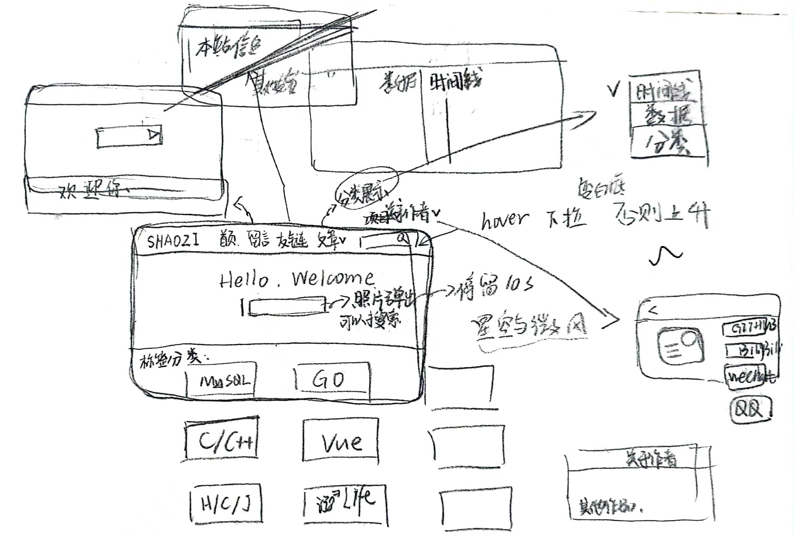

# 布局

### 初稿


### 

### 二版


# 新知识

## Chart.js

```plaintext
实现多种表的渲染
```

### 1.注册使用

```html
 <canvas id="chart" width="800" height="619" viewBox="0 0 800 619"></canvas>
```


```vue
import { Chart } from 'chart.js';
import { registerables } from 'chart.js';
Chart.register(...registerables);
```


### 2.多种表切换

```html
 <button @click="changeChartType" id="button">换一种统计方式？</button>
```

重置默认颜色

```js
Chart.defaults.backgroundColor = '#9BD0F5';
Chart.defaults.borderColor = '#36A2EB';
Chart.defaults.color = '#000';
```

表切换函数

```javascript
function changeChartType() {
    chart.destroy();
    chartType = chartType === 'bar' ? 'line' : chartType === 'line' ? 'pie' : chartType === 'pie' ? 'bubble' : chartType === 'bubble' ? 'doughnut' : chartType === 'doughnut' ? 'polarArea' : chartType === 'polarArea' ? 'radar' : chartType === 'radar' ? 'scatter' : 'bar';
    const articleCounts = JSON.parse(localStorage.getItem('articleCounts'));
    const labels = Object.keys(articleCounts).map(label => decodeURIComponent(label));
    const data = Object.values(articleCounts);
    const ctx = document.getElementById('chart').getContext('2d');
    chart = new Chart(ctx, {
        type: chartType,
        data: {
            labels,
            datasets: [{
                label: '文章数量',
                data,
                backgroundColor: [
                    'rgba(204,180, 44, 0.8)',
                    'rgba(220,239,233, 0.8)',
                    'rgba(164,214,211, 0.8)',
                    'rgba(116,164, 88, 0.8)',
                    'rgba( 62, 99, 66, 0.8)',
                ],
                borderColor: chartType === 'line' ? 'black'
                    : [
                        // 'rgba(204,180, 44)',
                        // 'rgba(220,239,233)',
                        // 'rgba(164,214,211)',
                        // 'rgba(116,164, 88)',
                        // 'rgba( 62, 99, 66)',
                        'rgba(0,0,0,0.8)'
                    ],
                color:['rgba(0, 0, 0, 0.8)'],//字体颜色
                borderWidth: chartType === 'line' ? 3 : 1
            }]
        },
        options: {
            responsive: true,
            maintainAspectRatio: false,
            title: {
                display: true,
                text: '分类数量统计'
            },
            scales: {
                y: {
                    beginAtZero: true,
                    title: {
                        display: true,
                        text: '数量'
                    }
                },
                x: {
                    title: {
                        display: true,
                        text: '分类'
                    }
                }
            },
            legend: {
                display: true,
                labels: {
                    generateLabels: (chart) => {
                        const labels = chart.data.labels;
                        const colors = chart.data.datasets[0].backgroundColor;
                        return labels.map((label, index) => {
                            return {
                                text: label,
                                fillStyle: colors[index],
                                strokeStyle: colors[index],
                                lineWidth: 1,
                                hidden: false
                            };
                        });
                    }
                }
            },
            animation: {
                duration: 1500,
                easing: 'easeInOutQuad'
            }
        }
    });
}
```

## Search.vue组件

搜索弹出白框并且背景变暗 input 聚焦等

```html
<template>
    <div class="search-container" :style="{ background: searchBackground }" >
        <div class="search-overlay" tabindex="0" @click="removeDarkBackground"/>
        <div :class="['search-form-container', isFocused ? 'search-form-container-focused' : '']" >
            <form @submit.prevent="performSearch">
                <div class="search-item">
                    <input type="text" placeholder="搜索文章..." v-model="searchQuery" ref="searchInput"
                    @focus="restoreDarkBackground" />
                    <button @mousedown.prevent type="submit"><i class="iconfont icon-sousuo"></i></button>
                </div>
            </form>
            <br>
            <!-- " @click="removeDarkBackground"  :class="['search-form-container', isFocused ? 'search-form-container-focused' : '']"   @blur="removeDarkBackground" -->
            <div v-if="searchResultVisible">
                <div v-if="titles.length === 0 && contents.length === 0" class="send">
                    <p>什么都没查询到捏 QAQ </p>
                    <p>想看相关内容? 点击导航栏"反馈"! </p>
                    <router-link :to="{ path: '/feedback' }"><button class="send"
                            @click.prevent="removeDarkBackgroundSecond()">点我私信作者</button>
                    </router-link>
                </div>
                <div v-else class="result">
                    <h3>标题搜索结果</h3>
                    <ul v-for="title in titles" :key="title.Id">
                        <li @click="getArticleContent(title.Id)">
                            {{ title.Title }}
                        </li>
                    </ul>
                    <br>
                    <h3>内容搜索结果</h3>
                    <ul v-for="content in contents" :key="content.Id">
                        <li @click="getArticleContent(content.Id)">
                            {{ content.Title }}
                        </li>
                    </ul>
                </div>
            </div>
        </div>
    </div>
</template>
```

```javascript
<script setup>

import Feedback from './Feedback.vue'
import ArticleContent from './ArticleContent.vue'
import { ref, onMounted } from 'vue'

import { useRouter } from 'vue-router'
const router = useRouter()

const searchInput = ref(null)
const searchQuery = ref('')
const searchBackground = ref('rgba(0, 0, 0, 0.5)')
const searchPosition = ref('relative')
const searchHeight = ref('88.5vh')
const isFocused = ref(false)
const searchResultVisible = ref(false)

onMounted(() => {
    searchInput.value.focus()
})

const removeDarkBackground = () => {
    searchBackground.value = 'transparent'
    searchPosition.value = 'relative'
    searchHeight.value = '88.5vh'
    isFocused.value = false
    searchResultVisible.value = false
}

const removeDarkBackgroundSecond = ( ) => {
    searchBackground.value = 'transparent'
    searchPosition.value = 'relative'
    searchHeight.value = '88.5vh'
    isFocused.value = false
    searchResultVisible.value = false
    if (confirm('即将跳转界面')) {
        router.push({ path: '/feedback' })
    }
}

const restoreDarkBackground = () => {
    searchBackground.value = 'rgba(0, 0, 0, 0.5)'
    searchPosition.value = 'fixed'
    searchHeight.value = '100vh'
    isFocused.value = true
}

const titles = ref([])
const contents = ref([])

const performSearch = async () => {
    if (!isFocused.value) return
    searchResultVisible.value = true
    setTimeout(() => {
        searchInput.value.focus();
    }, 0);

    const titleUrl = `http://127.0.0.1:8081/search?title=${encodeURIComponent(searchQuery.value)}`;
    const contentUrl = `http://127.0.0.1:8081/search?content=${encodeURIComponent(searchQuery.value)}`;

    try {
        const titleResponse = await fetch(titleUrl);
        const titleData = await titleResponse.json();
        titles.value = titleData.data

        const contentResponse = await fetch(contentUrl);
        const contentData = await contentResponse.json();
        contents.value = contentData.data
        console.log(titleData);
        console.log(contentData);
    } catch (error) {
        console.error(error);
    }
}

//获取文章id
const getArticleContent = (articleId) => {
    localStorage.setItem("articleId", articleId);
    router.push({ path: '/articleContent' });
};
</script>
```

## 友链传递

```plaintext
1.定义一个临时的申请用表application，用于获取用户的上传信息 有GET与POST和DELETE三种路由就可以
```

```go
//...友链申请...
	r.GET("/application", func(c *gin.Context) {
		id := c.Query("id")
		username := c.Query("username")
		web := c.Query("web")
		var applications []Application
		if username != "" {
			db.Where("name LIKE ?", "%"+username+"%").Find(&applications)
		} else if web != "" {
			db.Where("web = ?", web).Find(&applications)
		} else if id != "" {
			db.Where("Id = ?", id).Find(&applications)
		} else {
			db.Find(&applications)
		}
		c.JSON(http.StatusOK, gin.H{"data": applications})
	})
	r.POST("/application", func(c *gin.Context) {
		var application Application
		if err := c.ShouldBindJSON(&application); err == nil {
			db.Create(&application)
			c.JSON(200, gin.H{"data": application})
		} else {
			c.JSON(http.StatusBadRequest, gin.H{"error": err.Error()})
		}
	})
	r.DELETE("/application/:id", func(c *gin.Context) {
		var applications []Application
		id := c.Param("id")
		id1, _ := strconv.ParseUint(id, 10, 64)
		// 检查是否存在该ID的记录
		db.Where("Id=?", id1).First(&applications)
		// 如果记录存在，则删除记录
		err = db.Where("Id=?", id1).Delete(&applications).Error
		if err != nil {
			c.JSON(http.StatusInternalServerError, gin.H{"success": false, "message": "删除失败"})
			return
		}

		c.JSON(http.StatusOK, gin.H{"success": true, "message": "删除成功"})
	})

```

```plaintext
2.用户传上来的数据显示外加”同意申请“和”删除申请“即可
同意申请的同时将数据POST到友链的数据库
```

```html
 <button class="button" @click="applicationPost(application.Id)">同意申请</button>
```

```javascript
import { nextTick } from 'vue';

const applicationPost = async (index) => {
    const newFriendsWeb = ref('');
    try {
        const response = await fetch('http://127.0.0.1:8081/application?id=' + index)
        const data = await response.json()
        console.log(data)
        newFriendsWeb.value = data.data;
        await nextTick(); // wait for the assignment to complete
    } catch (error) {
        console.error(error)
    }
    try {
        const response = await fetch('http://127.0.0.1:8081/friendsWeb', {
            method: 'POST',
            headers: {
                'Content-Type': 'application/json'
            },
            body: JSON.stringify({
                name: newFriendsWeb.value[0].Name,
                web: newFriendsWeb.value[0].Web,
                introduction: newFriendsWeb.value[0].Introduction,
                img: newFriendsWeb.value[0].Img,
            }),
        })
        const data = await response.json()
        console.log(data)
        alert("友链添加成功 (^_^) !")
    } catch (error) {
        console.error(error)
    }
}
```


## markdown语法文章

数据库存入的是content部分

```html
<textarea v-model="content" class="markdown-input" />       <!-- markdown语法输入框 -->
<div class="markdown-preview" v-html="renderedContent"></div>   <!-- markdown语法渲染框 -->
```

从数据库读取后渲染出来

```javascript
import { marked } from 'marked';
const renderedContent = computed(() => {
  return marked(content.value);
});
```


# 问题记录

#### 一、接口测试时失效：

1.有外键时 传入不存在的分类名导致失效

```plaintext
Cannot add or update a child row: a foreign key constraint fails (`kh`.`articles`, CONSTRAINT `articles_ibfk_1` FOREIGN KEY (`category_id`) REFERENCES `categories` (`id`))
```


#### 二、css不接收鼠标事件

```css
 pointer-event:none;
```

#### 三、后台返回数据是数组（多个）

```javascript
body: JSON.stringify({
	name: newFriendsWeb.value[0].Name,
	web: newFriendsWeb.value[0].Web,
	introduction: newFriendsWeb.value[0].Introduction,
	img: newFriendsWeb.value[0].Img,
}),
```

#### 四、文件图片上传（go后端）

```c
file, _ := c.FormFile("img") //获取文件，忽略了错误处理
baseDir := "./PictureLoad/public/Picture/" //定义基本目录
filename := filepath.Base(file.Filename)   //获取上传的文件名
savePath := filepath.Join(baseDir, filename) //连接字段，形成存储路径
savePath = strings.ReplaceAll(savePath, "\\", "/") // 将路径用正斜杠保存，兼容不同操作系统，同时方便前端读取

_ = os.MkdirAll(baseDir, os.ModePerm) //创建保存路径所在目录，目录存在则忽略，同时忽略了错误处理
_ = c.SaveUploadedFile(file, savePath)
    
pu.Img = filename //只存储文件名字
pu.Name = c.PostForm("name")//数据库其他字段和数据

db.Create(&pu) // Ignore error
c.JSON(200, gin.H{"message": "created successfully", "data": pu})
```


