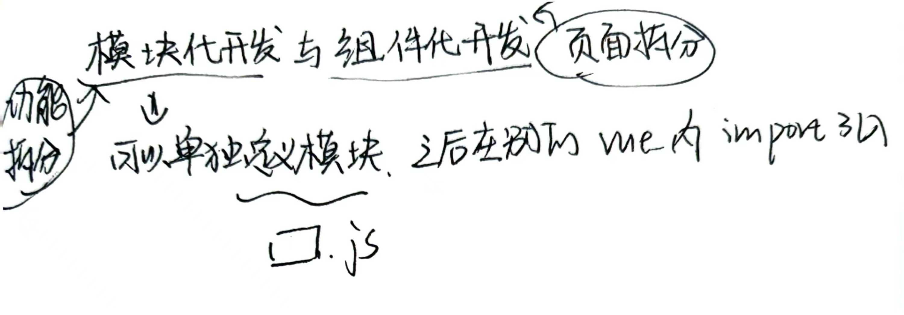
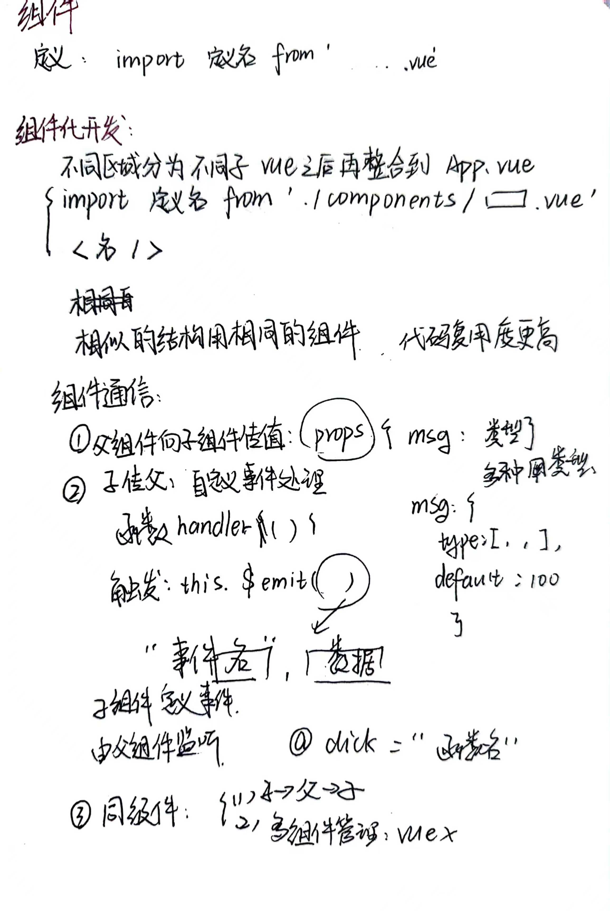
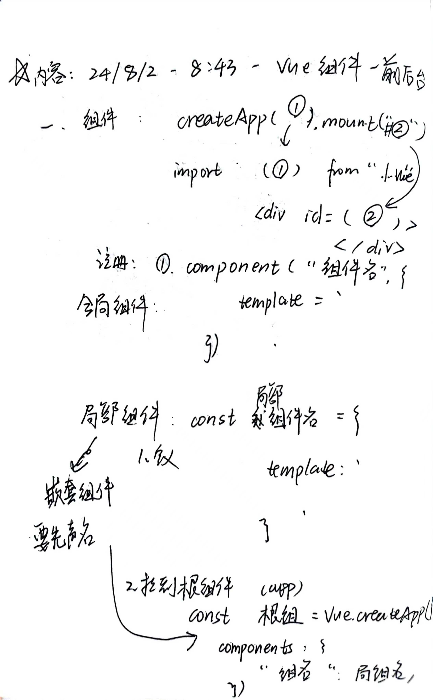
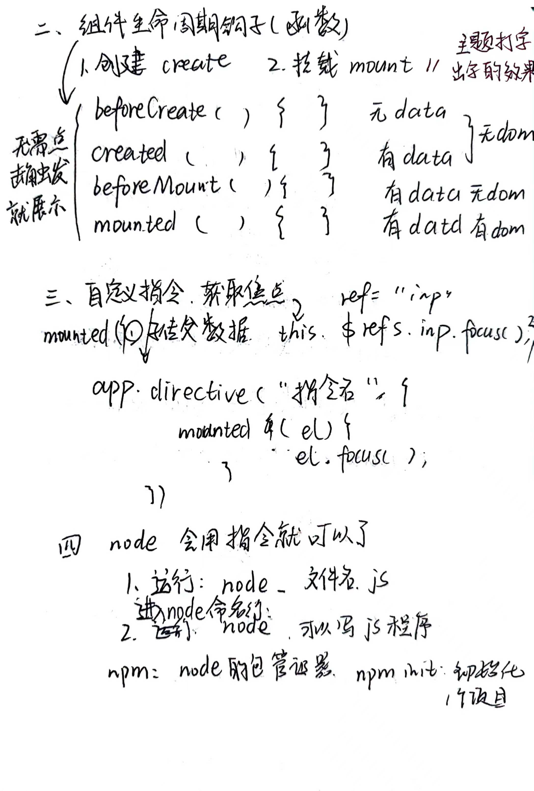
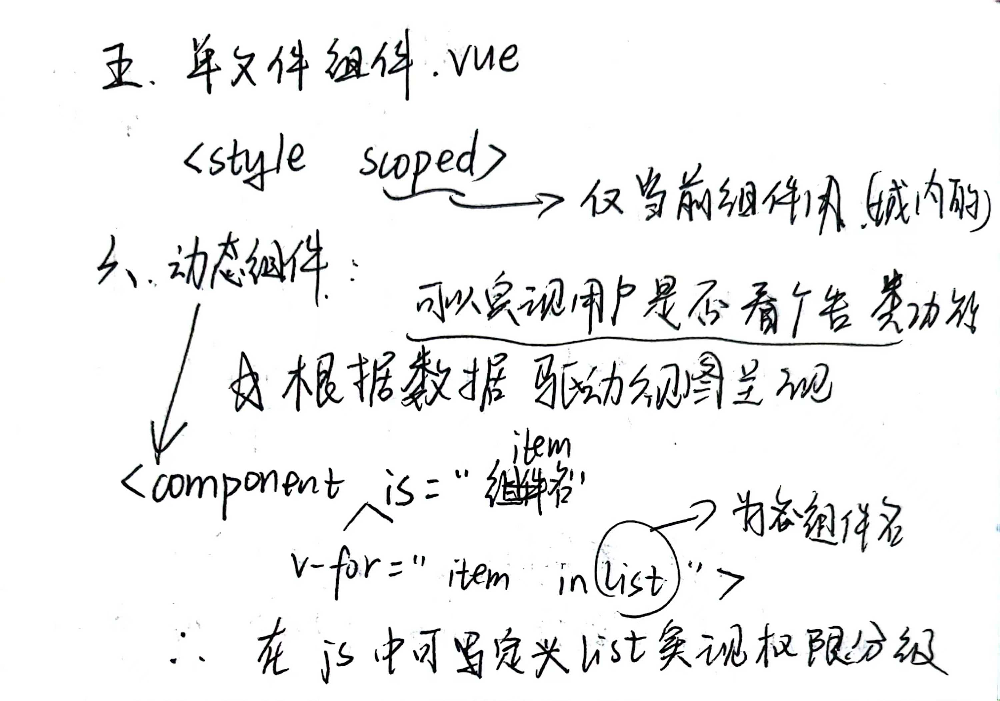
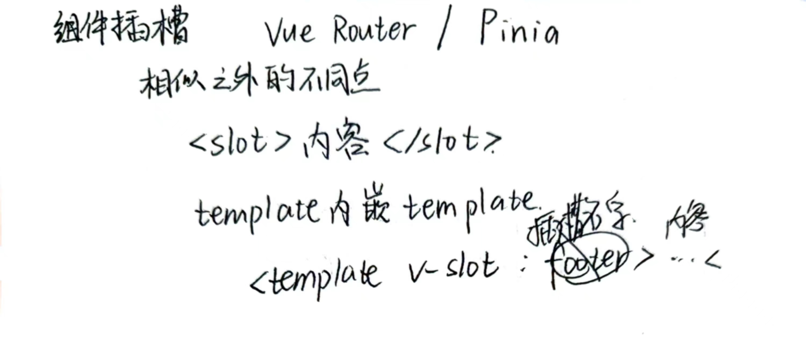
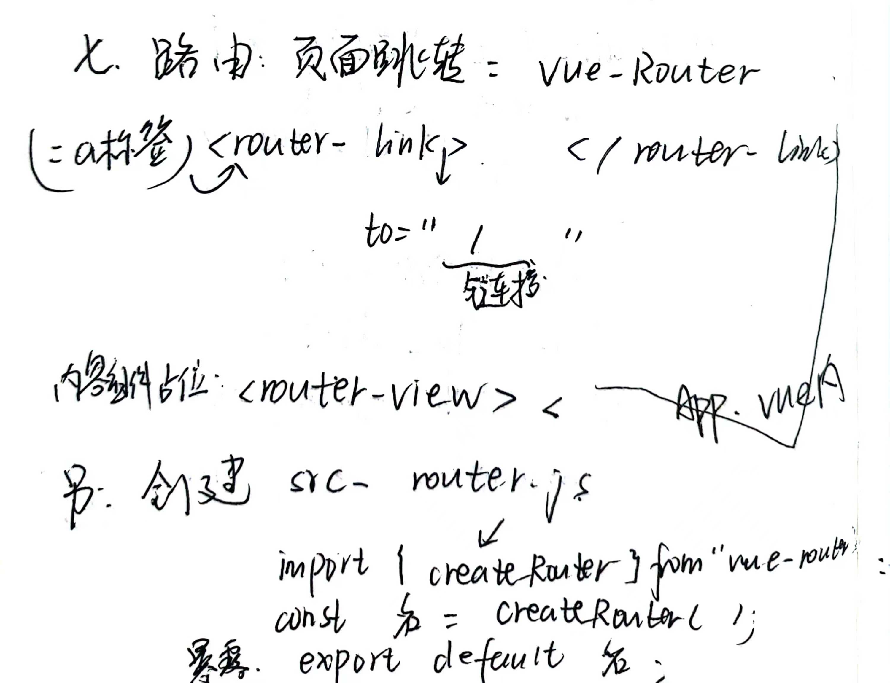
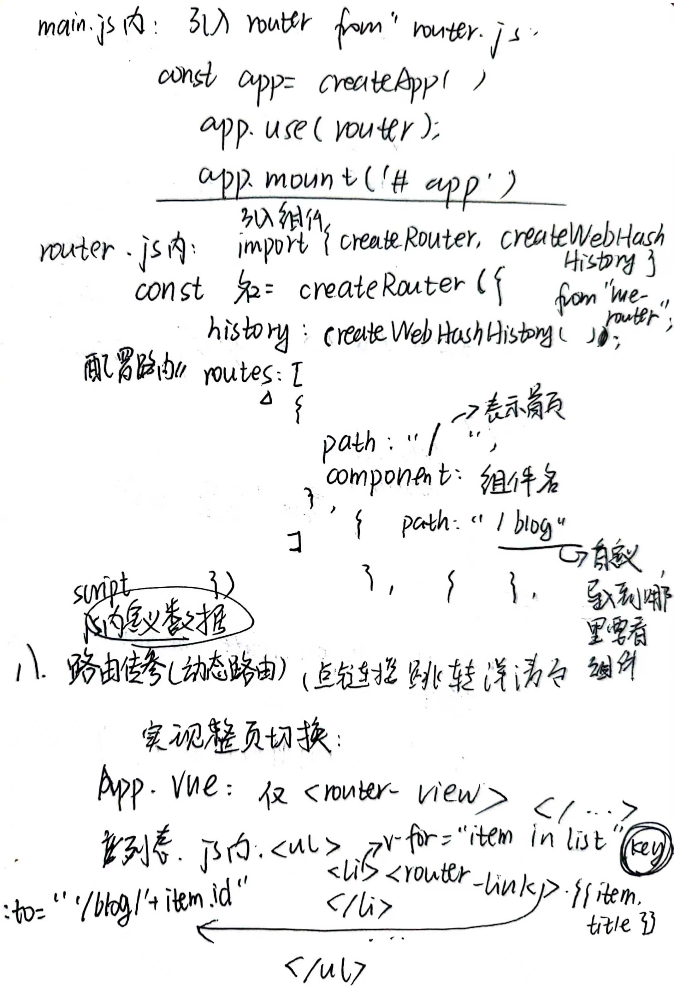
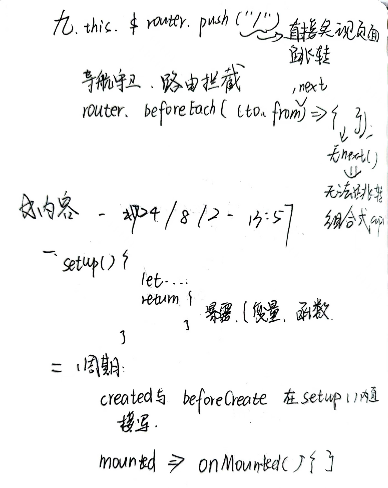

# 基础语法

### 模板语法

​	<template>

​	</template>

	

### 属性绑定

v-bind:    :

idButtonDisabled值  (button: disabled="idButtonDisabled" ):  true 不可见 false 可见

vue3组合式api

## 组件

### 生命周期

### 用户权限分级

### 插槽(组件复用不同点)

# Vue Router

## 路由

# Pinia

图解http 

化繁为简 / 知识全面
