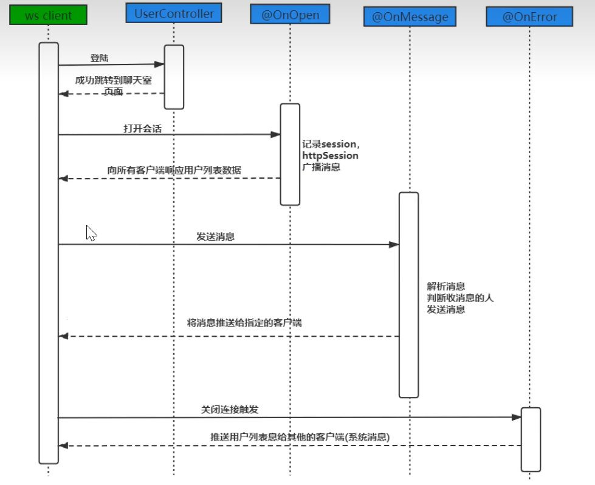

# 1. WebSocket

## 1.1 HTTP协议

HTTP是单项请求，无法实现服务器主动向客户端发起消息；服务器如果有连续变化就会非常浪费资源（轮询）

## 1.2 WebSocket协议

- 基于TCP协议

- 握手（基于HTTP协议，但是做了标识）
  - 来自客户端（请求头）的握手：Upgrade请求协议升级为WebSocket
  - 来自服务端（响应头）的握手："HTTP/1.1 101"为成功
  - 建立连接
- 数据交互（传输）
  - 可以互相发送信息

## 1.3 客户端（浏览器）实现

### 1.3.1 WebSocket 对象

 创建 WebSocket 对象 且服务器运行在 ws://localhost:8083

```javascript
socket = new WebSocket('ws://localhost:8083');
```

### 1.3.2 WebSocket 事件

WebSocket对象.onopen：连接建立时触发

```javascript
socket.onopen = function (event) {
	console.log('Connected to the chat server.');
};
```

WebSocket对象.onmessage：客户端接受服务端数据时触发

```javascript
socket.onmessage = function (event) {
	let messages = document.getElementById('messages');
	let message = document.createElement('div');
	message.classList.add('message');
	message.textContent = event.data;
	messages.appendChild(message);
	messages.scrollTop = messages.scrollHeight; // 滚动到底部
};
```

WebSocket对象.onclose：连接关闭时触发

```javascript
socket.onclose = function (event) {
	console.log('Disconnected from the chat server.');
	// 尝试重新连接
	setTimeout(connect, 5000);
};
```

WebSocket对象.onerror：通信发生错误时触发

```javascript
socket.onerror = function (error) {
	console.log('WebSocket Error: ', error);
};
```

### 1.3.3 WebSocket 方法

WebSocket对象.send( )：使用连接发送数据

```javascript
socket.send(input.value);
```

## 1.4 服务端实现


# 2. 需求分析

### 2.1 实现流程



### 2.2 消息格式

- 客户端 --> 服务端

​	{ "toName" : "名字" , "message" : "内容"}	

- 服务端 --> 客户端
  - 系统消息格式：{"isSystem" : true, "fromName" : null, "message" : ["名字1" , "名字n"]}
  - 个人消息格式：{"isSystem" : true, "fromName" : "名字" "message" : "内容"}

# 3. 功能实现


### 


